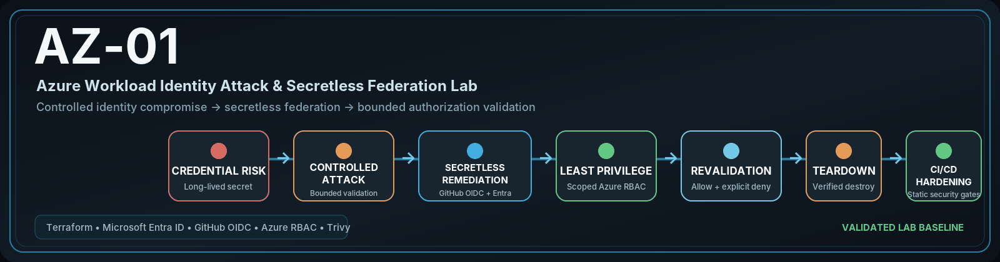

# Azure Workload Identity Security Engineering Project

> **Project Goal**
>
> Demonstrate how a long-lived Microsoft Entra workload credential and excessive Azure RBAC can create a practical identity attack path, then replace that design with GitHub OIDC, Microsoft Entra workload identity federation, reduced authorization scope, bounded re-attack validation, teardown verification, and repository-level DevSecOps controls.

<p align="center">


</p>

<p align="center">
  <a href="https://github.com/nagasesank/AZ-01-azure-workload-identity-security-lab/actions/workflows/security-ci.yml">
    
  </a>
</p>

## AZ-01 — Azure Workload Identity Attack & Secretless Federation Lab

AZ-01 is a controlled, evidence-driven **Azure identity security engineering lab** focused on workload identity risk, credential exposure, Azure RBAC blast radius, secretless federation, and post-remediation authorization testing.

The project deliberately created a vulnerable Microsoft Entra workload identity inside a bounded lab environment, validated the resulting attack path only against known project-owned targets, remediated the design with **GitHub OIDC + Microsoft Entra workload identity federation**, reduced authorization to the intended Azure Storage container scope, re-ran controlled positive and negative tests, destroyed the validation environment, and hardened the repository with static security CI and protected-main controls.

The lab uses **synthetic data and project-owned Azure resources only**. It does not claim production suitability, universal least privilege, penetration testing coverage, HIPAA/HITRUST compliance, or broad Azure security assurance.

<p align="center">
  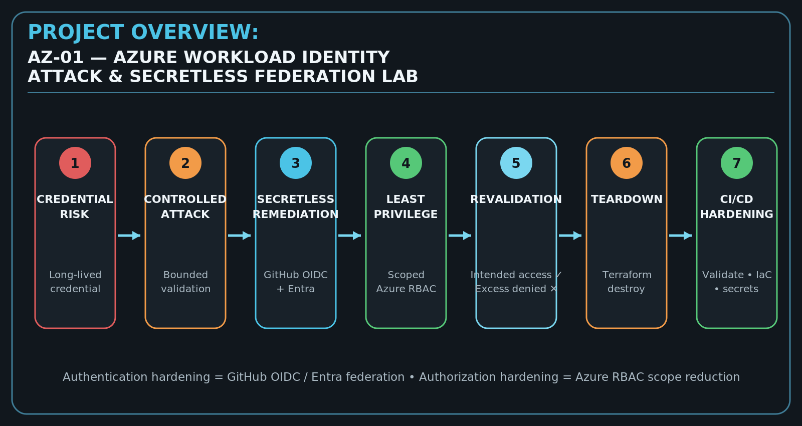
</p>

## Project Objectives

The primary objectives of this project are to:

- Model a realistic long-lived workload credential risk in Microsoft Entra ID.
- Demonstrate the impact of excessive but bounded Azure RBAC.
- Validate attack behavior without arbitrary subscription enumeration or production data access.
- Use a project-owned negative control to prove authorization containment.
- Replace persistent workload credentials with GitHub OIDC federation.
- Reduce Azure authorization to the narrowest practical workload scope.
- Re-run the security tests after remediation and classify denials explicitly.
- Preserve sanitized, reviewable evidence for each validation phase.
- Destroy cloud resources after the validation window.
- Protect the validated source baseline with Terraform, IaC, secret-scanning, and repository controls.

## Key Features

### Workload Identity Security

- Microsoft Entra application and service-principal modeling
- Long-lived credential risk demonstration
- GitHub OIDC federation
- Microsoft Entra federated identity credential
- Authentication and authorization treated as separate security controls

### Controlled Attack Validation

- Known project-owned targets only
- Synthetic Azure Storage data
- Dedicated negative-control resource group
- Controlled management-plane mutation with restoration
- Explicit authorization-denial classification
- No destructive or arbitrary subscription-wide attack behavior

### Least-Privilege Remediation

- Persistent workload client-secret path removed
- Container-scoped `Storage Blob Data Reader`
- No workload Contributor role after remediation
- No workload management-plane Reader role after remediation
- No negative-control role assignment

### Evidence-Driven Engineering

- Phase-wise validation records
- Sanitized screenshots
- Positive and negative controls
- Separate pre-remediation and post-remediation evidence
- Terraform teardown verification
- Conservative security claims tied to tested behavior

### DevSecOps Hardening

- Terraform formatting and validation gate
- Trivy IaC security scanning
- Trivy current-content secret scanning
- Controlled CI negative-path test
- Protected `main`
- Read-only GitHub Actions defaults
- Historical runtime workflows disabled after evidence capture
- Dependabot policy with explicit review for major upgrades

## Project Overview

The project follows a complete security-engineering lifecycle rather than stopping after remediation.

```text
Design vulnerable workload identity
        ↓
Terraform deployment
        ↓
Validate vulnerable baseline
        ↓
Controlled credential-compromise tests
        ↓
Capture sanitized evidence
        ↓
Destroy vulnerable deployment
        ↓
Create fresh secretless validation deployment
        ↓
GitHub OIDC + Microsoft Entra federation
        ↓
Reduce Azure RBAC scope
        ↓
Run bounded post-remediation validation
        ↓
Verify intended access + explicit denials
        ↓
Terraform destroy
        ↓
Verify bounded cleanup
        ↓
Harden CI/CD + repository controls
        ↓
Project closeout
```

## Why This Project?

Workload identities are frequently used by applications and CI/CD systems to access cloud resources. A long-lived client secret can become a replayable credential if it is copied, leaked, logged, or stored incorrectly. If the associated service principal also has excessive permissions, credential compromise can produce a much larger authorization blast radius.

AZ-01 demonstrates the security difference between two distinct controls:

- **Authentication hardening:** replace a persistent secret with short-lived GitHub OIDC federation.
- **Authorization hardening:** reduce Azure RBAC to only the resource and actions required by the workload.

The project then verifies those controls through runtime testing instead of assuming that a Terraform configuration is secure simply because it looks restrictive.

## Repository Highlights

| Category | Details |
| --- | --- |
| Cloud Provider | Microsoft Azure |
| Identity Platform | Microsoft Entra ID |
| Infrastructure as Code | Terraform |
| Vulnerable Authentication | Temporary long-lived service-principal credential |
| Remediated Authentication | GitHub OIDC + Microsoft Entra workload identity federation |
| Authorization | Azure RBAC |
| Intended Data Access | Container-scoped synthetic Azure Blob metadata/read path |
| Negative Control | Separate project-owned resource group and canary identity |
| Attack Validation | AT-01 through AT-05 |
| Post-Remediation Validation | RT-01 through RT-06, including RT-04R/RT-04W separation |
| CI/CD | Terraform validation, IaC scan, secret scan |
| Evidence | Sanitized screenshots + written validation records |
| Teardown | Terraform destroy + bounded post-destroy verification |
| Current Azure State | Validation environment destroyed |

## Table of Contents

- [Solution Architecture](#solution-architecture)
- [Technology Stack](#technology-stack)
- [Repository Structure](#repository-structure)
- [Security Engineering Lifecycle](#security-engineering-lifecycle)
- [Design Principles](#design-principles)
- [Vulnerable Baseline](#vulnerable-baseline)
- [Secretless Federation Remediation](#secretless-federation-remediation)
- [Post-Remediation Validation](#post-remediation-validation)
- [CI/CD and Repository Hardening](#cicd-and-repository-hardening)
- [Documentation](#documentation)
- [Engineering Highlights](#engineering-highlights)
- [Validation Evidence](#validation-evidence)
- [Repository Metrics](#repository-metrics)
- [Project Screenshots](#project-screenshots)
- [Implementation Roadmap](#implementation-roadmap)
- [Future Maintenance](#future-maintenance)
- [Learning Outcomes](#learning-outcomes)
- [Security and Evidence Hygiene](#security-and-evidence-hygiene)
- [License](#license)
- [Author](#author)

## Solution Architecture

The project intentionally uses two security states: a vulnerable baseline and a later secretless validation deployment. They are separate validation windows; the project does not claim in-place replay testing of the retired Phase 3 credential.

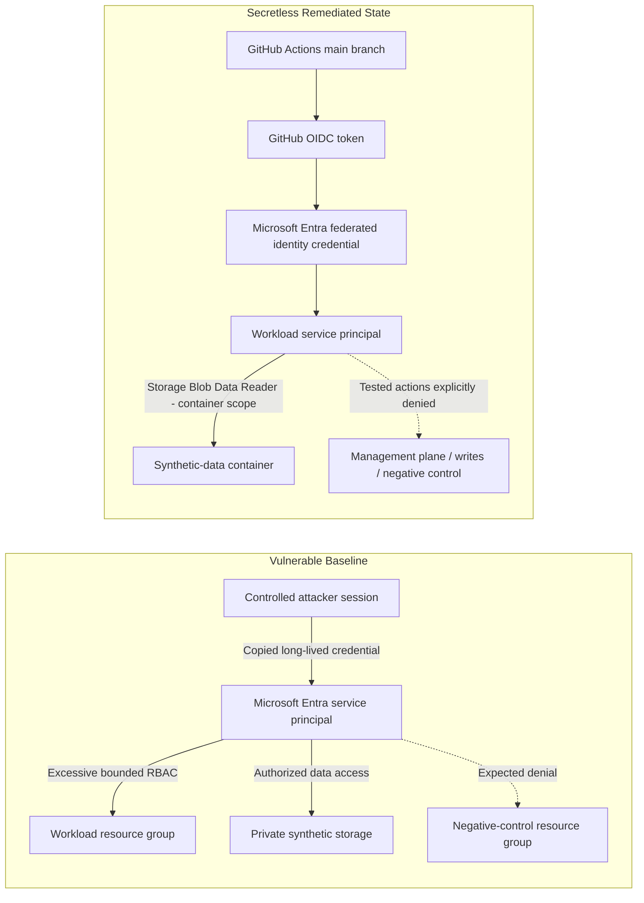

Detailed architecture and design records:

- [Architecture index](docs/architecture/README.md)
- [Phase 1 architecture](docs/architecture/phase-1-architecture.md)
- [Security decisions](docs/architecture/security-decisions.md)
- [Workload identity threat model](docs/threat-model/workload-identity-threat-model.md)
- [Phase 4 remediation](docs/implementation/phase-4-remediation.md)

## Technology Stack

<p align="center">
  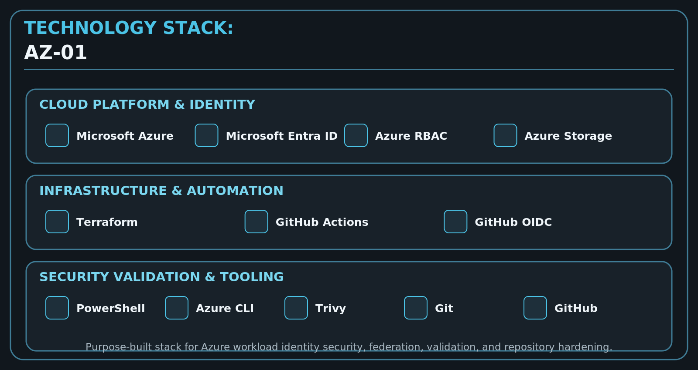
</p>

### Cloud and Identity

| Technology | Purpose |
| --- | --- |
| Microsoft Azure | Project-owned cloud validation environment |
| Microsoft Entra ID | Workload application, service principal, federation |
| Azure RBAC | Resource-plane authorization |
| Azure Storage | Private synthetic-data validation target |
| Azure CLI | Owner-operated and controlled runtime validation |

### Infrastructure and Automation

| Technology | Purpose |
| --- | --- |
| Terraform | Infrastructure and identity configuration |
| HashiCorp AzureRM | Azure resource-plane resources |
| HashiCorp AzureAD | Microsoft Entra identity resources |
| PowerShell | Controlled local validation harnesses |
| GitHub Actions | Runtime validation history and static security CI |
| GitHub OIDC | Short-lived external workload authentication |
| Trivy | IaC misconfiguration and current-content secret scanning |

## Repository Structure

<p align="center">
  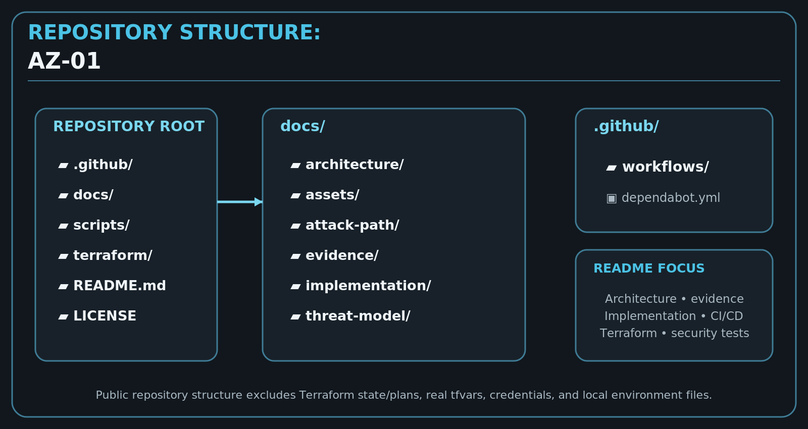
</p>

```text
AZ-01-azure-workload-identity-security-lab/
│
├── .github/
│   ├── workflows/
│   │   ├── phase-4-oidc-validation.yml
│   │   ├── phase-5-oidc-validation.yml
│   │   └── security-ci.yml
│   └── dependabot.yml
│
├── docs/
│   ├── architecture/
│   ├── attack-path/
│   ├── assets/
│   ├── evidence/
│   │   └── screenshots/
│   ├── implementation/
│   └── threat-model/
│
├── scripts/
│   ├── attack-tests.ps1
│   ├── phase-5-owner-preflight.ps1
│   ├── validate-phase2.ps1
│   └── validate.ps1
│
├── terraform/
│   ├── identity.tf
│   ├── rbac.tf
│   ├── storage.tf
│   ├── negative-control.tf
│   ├── outputs.tf
│   ├── variables.tf
│   └── versions.tf
│
├── .gitignore
├── .trivyignore.yaml
├── LICENSE
└── README.md
```

## Security Engineering Lifecycle

The engineering workflow used throughout the project was:

```text
CREATE
  ↓
Terraform apply
  ↓
Validate
  ↓
Capture evidence
  ↓
Inject controlled attack / failure
  ↓
Investigate
  ↓
Remediate
  ↓
Revalidate
  ↓
Capture remediation evidence
  ↓
Terraform destroy
  ↓
Verify cleanup
```

This separates infrastructure creation, attack validation, remediation, evidence review, and teardown into explicit engineering stages.

## Design Principles

The repository follows these security-engineering principles:

- Infrastructure as Code as the source of truth
- Synthetic data only
- Project-owned test targets only
- Bounded blast radius
- Authentication and authorization separation
- Principle of least privilege
- Positive and negative security controls
- Explicit authorization-denial classification
- Evidence before claims
- No production/customer data
- No arbitrary subscription enumeration
- Complete resource lifecycle management
- Cost-conscious teardown
- Protected source baseline

## Vulnerable Baseline

The vulnerable phase intentionally used a temporary long-lived Microsoft Entra service-principal credential with excessive but project-bounded Azure RBAC.

### Controlled Attack Matrix

| Test | Validation | Result |
| --- | --- | --- |
| AT-01 | Vulnerable workload credential authentication | PASS |
| AT-02 | Workload resource-group enumeration | PASS |
| AT-03 | Benign management-plane tag mutation + restoration | PASS |
| AT-04 | Known synthetic blob access | PASS |
| AT-05 | Project-owned negative-control access | DENIED as expected |

The negative control is important: it demonstrates that successful credential compromise did not imply access to every project-owned target.

Detailed evidence:

- [Attack-path plan](docs/attack-path/phase-1-attack-plan.md)
- [Phase 3 evidence](docs/evidence/phase-3.md)

## Secretless Federation Remediation

The later remediation deployment replaced the persistent workload-secret architecture with short-lived federation.

```text
GitHub Actions
      ↓
GitHub-issued OIDC token
      ↓
Microsoft Entra federated identity credential
      ↓
Workload service principal
      ↓
Azure RBAC
      ↓
Exact synthetic-data container scope
```

### Security Changes

| Control Area | Vulnerable State | Remediated State |
| --- | --- | --- |
| Workload authentication | Long-lived client secret | GitHub OIDC federation |
| Credential storage | Replayable persistent credential existed for lab validation | No persistent Azure workload client secret |
| Azure authorization | Excessive workload-RG permissions | Container-scoped `Storage Blob Data Reader` |
| Negative control | No role assignment | No role assignment retained |
| Trust boundary | Credential possession | Exact reviewed GitHub OIDC trust tuple |

OIDC addresses **credential lifecycle and authentication risk**. Azure RBAC scope reduction addresses **authorization blast radius**. Both controls are required.

## Post-Remediation Validation

The project did not stop after changing Terraform. Phase 5 executed bounded runtime checks against the remediated workload identity.

| Test | Tested behavior | Observed result |
| --- | --- | --- |
| RT-01 | GitHub OIDC authentication + intended Azure context | PASS |
| RT-02 | Workload resource-group enumeration | Explicitly denied |
| RT-03 | Benign management-plane tag mutation | Explicitly denied |
| RT-04R | Known synthetic blob metadata/read path | PASS |
| RT-04W | Dedicated synthetic blob creation/write | Explicitly denied |
| RT-05 | Negative-control canary access | Explicitly denied |
| RT-06 | Account-level container listing | Explicitly denied |
| Cleanup | Workload CLI session/profile cleanup | PASS |

These observations apply only to the tested actions and known project-owned targets. They do not prove universal denial or universal least privilege.

- [Phase 4 runtime validation](docs/evidence/phase-4-runtime-validation.md)
- [Phase 5 runtime validation](docs/evidence/phase-5-runtime-validation.md)

## CI/CD and Repository Hardening

Phase 6 protects the validated source baseline without recreating the Azure environment.

### Required Security CI Jobs

| Job | Purpose |
| --- | --- |
| `terraform-static-validation` | Terraform formatting, backend-free initialization, and validation |
| `iac-security-scan` | Trivy Terraform misconfiguration scan |
| `secret-scan` | Trivy current-repository-content secret scan |

The CI workflow uses explicit `contents: read` permission and does **not** authenticate to Azure, request OIDC `id-token`, run Terraform plan/apply/destroy, or mutate cloud infrastructure.

### Controlled Failure Validation

CF-01 created a deliberately misformatted but valid Terraform fixture only in runner temporary storage. The production formatting gate rejected the fixture, accepted the remediated format, cleaned up the temporary file, and then intentionally failed the controlled validation run. The production CI workflow was restored with zero net workflow change.

### Repository Controls

- Pull requests required for `main`
- Three security CI jobs required
- Required checks use up-to-date branch state
- Force-push protection
- Branch-deletion protection
- Read-only default GitHub Actions workflow permissions
- Historical Phase 4/5 Azure OIDC workflows disabled after evidence capture
- Historical repository variables/secrets cleaned up after teardown
- Weekly Dependabot visibility retained
- Major dependency/provider upgrades require explicit compatibility review

Documentation:

- [Phase 6 CI/CD plan](docs/implementation/phase-6-cicd-security-plan.md)
- [Phase 6 CI/CD implementation](docs/implementation/phase-6-cicd-security-controls.md)
- [Controlled failure validation](docs/implementation/phase-6-controlled-failure-validation.md)
- [Repository hardening](docs/implementation/phase-6-repository-hardening.md)
- [Project retrospective](docs/implementation/project-retrospective.md)

## Documentation

The repository preserves technical documentation for architecture, threat modeling, implementation, validation, evidence, teardown, and project closeout.

| Documentation Area | Description | Link |
| --- | --- | --- |
| Architecture | System design and security decisions | [Architecture](docs/architecture/README.md) |
| Threat Model | Credential, RBAC, federation, and trust-boundary analysis | [Threat Model](docs/threat-model/README.md) |
| Attack Path | Controlled attack design and post-remediation plan | [Attack Path](docs/attack-path/README.md) |
| Evidence | Phase-wise validation records and screenshots | [Evidence](docs/evidence/README.md) |
| Implementation | Remediation, CI/CD, hardening, retrospective | [Implementation](docs/implementation/README.md) |
| Scripts | Controlled validation harness documentation | [Scripts](scripts/README.md) |
| Terraform | Infrastructure and replay guidance | [Terraform](terraform/README.md) |
| GitHub | Workflow and repository-control files | [.github/](.github/) |

## Engineering Highlights

This project demonstrates practical experience with:

- Azure workload identity security
- Microsoft Entra application and service-principal architecture
- GitHub OIDC federation
- Azure RBAC least-privilege design
- Terraform identity and resource-plane separation
- Controlled credential-compromise validation
- Positive and negative authorization testing
- Security test classification
- Infrastructure teardown verification
- GitHub Actions least-privilege design
- IaC security scanning
- Secret scanning
- Controlled CI failure injection
- Protected-main repository governance
- Evidence-driven technical documentation

## Validation Evidence

Evidence was captured after controlled validation steps and sanitized before publication. Raw authentication logs, credential values, Terraform state, and sensitive Azure identifiers are not preserved as public evidence.

| Evidence Phase | Coverage |
| --- | --- |
| Phase 2 | Infrastructure deployment and baseline validation |
| Phase 3 | Vulnerable credential-compromise attack validation |
| Phase 4 | GitHub OIDC positive-path runtime validation |
| Phase 5 | Post-remediation positive and denial testing |
| Phase 7 | Terraform destroy and bounded cleanup verification |

Evidence index:

- [Phase 2 validation](docs/evidence/phase-2-validation.md)
- [Phase 3 attack validation](docs/evidence/phase-3.md)
- [Phase 4 OIDC runtime validation](docs/evidence/phase-4-runtime-validation.md)
- [Phase 5 post-remediation validation](docs/evidence/phase-5-runtime-validation.md)
- [Phase 7 teardown validation](docs/evidence/phase-7-teardown-validation.md)

## Repository Metrics

| Metric | Count / State |
| --- | ---: |
| Cloud Providers | 1 — Microsoft Azure |
| Project Phases | 8 — Phase 0 through Phase 7 |
| Controlled Attack Tests | 5 — AT-01 through AT-05 |
| Post-Remediation Runtime Cases | 7 — RT-01, RT-02, RT-03, RT-04R, RT-04W, RT-05, RT-06 |
| Required Security CI Jobs | 3 |
| Evidence Screenshot Phases | 5 |
| Main Branch Protection | Enabled |
| Azure Validation Environment | Destroyed |
| Long-Lived Workload Secret | Not recreated |
| Historical Azure OIDC Validation Workflows | Disabled |

## Project Screenshots

The following sanitized screenshots represent key stages of the security lifecycle.

| Vulnerable Credential Authentication | Negative-Control Denial |
| --- | --- |
| 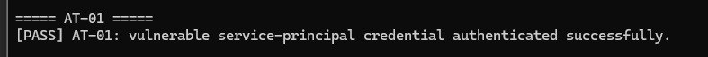 | 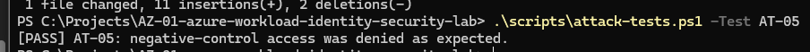 |

**Figure 1:** Controlled vulnerable workload credential authentication.

**Figure 2:** Project-owned negative-control access denied as expected.

| GitHub OIDC Runtime Validation | Post-Remediation Validation |
| --- | --- |
| 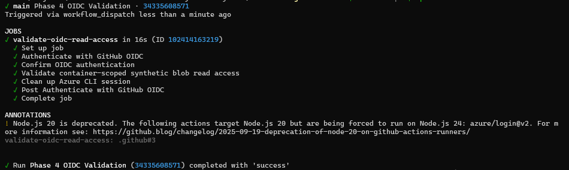 | 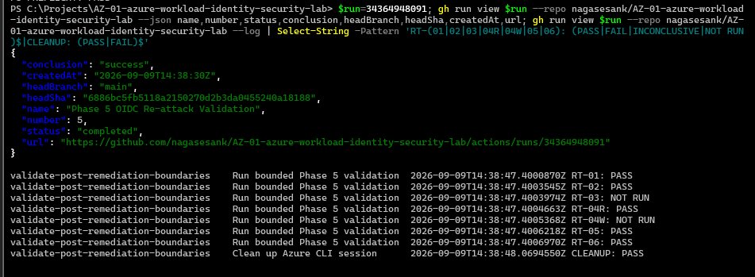 |

**Figure 3:** Secretless GitHub OIDC runtime validation completed successfully.

**Figure 4:** Non-mutating post-remediation validation of intended access and tested denial boundaries.

| Management-Plane Mutation Denied | Terraform Teardown |
| --- | --- |
| 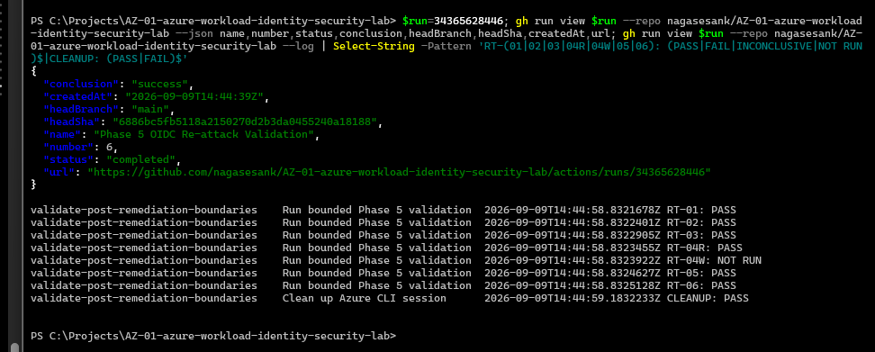 | 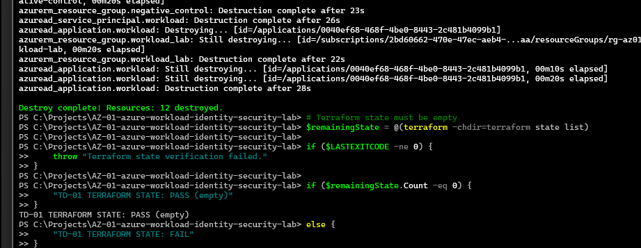 |

**Figure 5:** Reviewed benign management-plane mutation received explicit authorization denial.

**Figure 6:** Terraform destroy completed for the later validation deployment.

## Implementation Roadmap

<p align="center">
  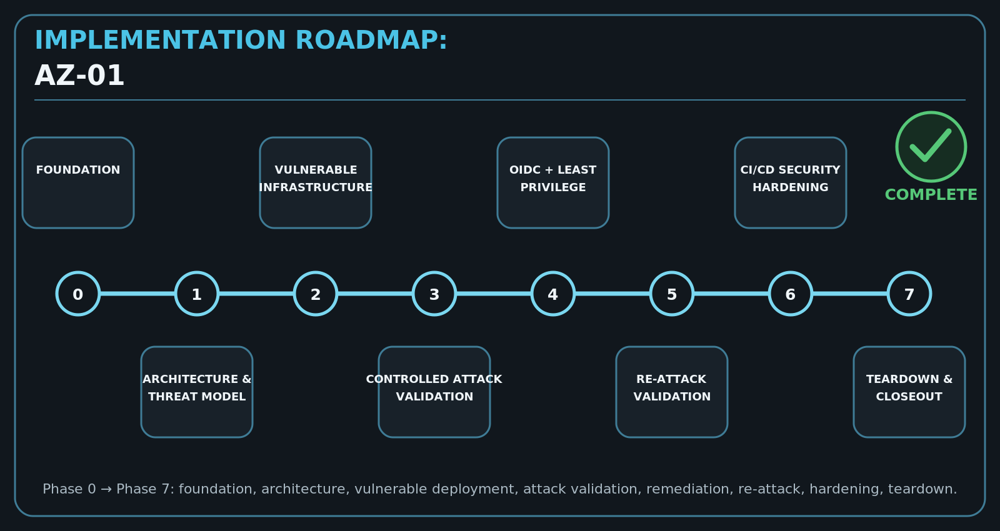
</p>

### Completed

- Phase 0 — Repository and Azure connectivity foundation
- Phase 1 — Architecture and threat modeling
- Phase 2 — Vulnerable workload identity infrastructure
- Phase 3 — Controlled credential-compromise validation
- Phase 4 — GitHub OIDC and least-privilege remediation
- Phase 5 — Post-remediation re-attack validation
- Phase 6 — Static security CI and repository hardening
- Phase 7 — Teardown, cleanup verification, and retrospective

### Final Project State

```text
Vulnerable baseline: COMPLETE
OIDC remediation: COMPLETE
Post-remediation runtime validation: COMPLETE
Static security CI: COMPLETE
Controlled CI failure validation: COMPLETE
Repository hardening: COMPLETE
Teardown verification: COMPLETE
Project retrospective: COMPLETE
Azure validation environment: DESTROYED
Historical OIDC workflows: DISABLED
Long-lived workload client secret: NOT RECREATED
```

## Future Maintenance

The implementation is closed as a validated lab baseline. Future work should focus on maintenance rather than expanding old runtime claims.

- Review Terraform provider compatibility before any future replay.
- Review the time-bounded Trivy `AZU-0012` exception before expiration or redeployment.
- Revalidate GitHub OIDC and Azure behavior if the lab is rebuilt in a new validation window.
- Keep dependency updates behind protected-main CI.
- Continue excluding credentials, state, plans, raw authentication logs, and sensitive runtime identifiers from public evidence.

## Learning Outcomes

- Workload credential compromise and replay risk
- Microsoft Entra service-principal security
- GitHub OIDC workload federation
- Authentication vs authorization separation
- Azure RBAC scope reduction
- Negative-control security testing
- Explicit denial classification
- Terraform-based security architecture
- Runtime validation after remediation
- Secure evidence handling
- Resource teardown verification
- Static DevSecOps security gates
- CI negative-path testing
- Protected repository governance

## Security and Evidence Hygiene

Never commit or publish:

- Azure client secrets
- access or refresh tokens
- Terraform state or plan files
- Azure CLI caches
- `.env` credential material
- tenant/subscription/application/object/principal identifier values in public runtime evidence
- raw authentication logs
- production/customer/personal data

The exact GitHub OIDC issuer/audience/subject trust tuple is retained as **public, non-secret configuration metadata** in the Terraform and architecture decision record. It is not a credential and cannot independently authenticate to Microsoft Entra.

Historical Phase 4/5 runtime workflows remain in source control for provenance but are disabled. Re-enabling them requires a new explicit validation and review cycle.

## License

This project is licensed under the MIT License.

See the [LICENSE](LICENSE) file for additional information.

## Author

**Surya**

Cloud Security Engineer | Azure | AWS | Terraform | DevSecOps | IAM

[](https://github.com/nagasesank)
[](https://www.linkedin.com/in/suryasesank/)

## Acknowledgements

This project was built as a hands-on cloud-security engineering portfolio case study to demonstrate the complete lifecycle of workload identity risk analysis, controlled attack validation, secretless federation, least-privilege remediation, post-remediation verification, teardown, and DevSecOps hardening.

<p align="center">

Built with Terraform, Microsoft Azure, Microsoft Entra ID, GitHub OIDC, GitHub Actions, PowerShell, and evidence-driven security engineering.

</p>
