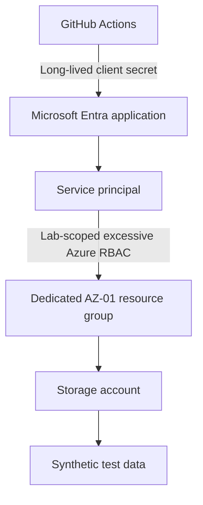
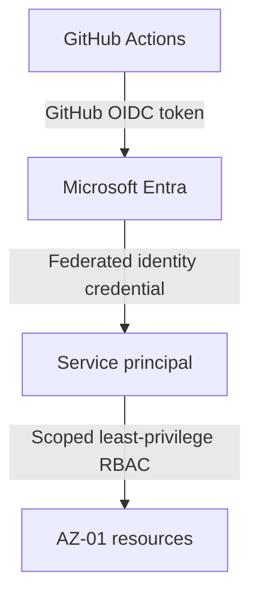

# Phase 1 Architecture

## Security Objective

This lab will show how a long-lived workload credential and deliberately excessive Azure RBAC can be abused, then replace that design with GitHub OIDC and least-privilege authorization. Every future experiment is constrained to a dedicated AZ-01 resource group and synthetic data.

No infrastructure described here exists yet.

## Planned Vulnerable State

The intentional weakness is a temporary client secret used by GitHub Actions and an RBAC role that is excessive for the workload, but only within the dedicated lab resource group. It is not subscription-wide Owner, subscription-wide Contributor, Global Administrator, Privileged Role Administrator, or unrestricted tenant access.

## Planned Remediated State

The federated credential will be restricted to the intended GitHub repository and branch or environment. The final role assignments will permit only the workload actions required within the narrowest practical scope.

## Identity Flow

In the vulnerable state, GitHub Actions presents a long-lived client secret to Microsoft Entra and receives a token for the service principal. In the remediated state, GitHub Actions exchanges a short-lived OIDC token for a Microsoft Entra token under an exact federated subject claim. The secret is removed.

Authentication establishes the identity of the service principal. Authorization is separately evaluated by Azure RBAC and any applicable data-plane authorization.

## Azure Control-Plane Flow

Azure Resource Manager evaluates the service principal's Azure RBAC assignment before allowing management-plane operations on resources in the dedicated AZ-01 resource group. Future tests may demonstrate an intentionally excessive, but resource-group-scoped, action and then verify that the narrowed role denies it after remediation.

## Azure Data-Plane Flow

Data-plane access is distinct from Azure Resource Manager control-plane access. A future synthetic-data test will use only explicitly granted data-plane permissions and will record whether the final least-privilege design still requires that access. No production or sensitive data is in scope.

## Trust and Security Boundaries

- GitHub to Microsoft Entra: GitHub workflow identity and OIDC or secret-based authentication cross into Microsoft Entra.
- Microsoft Entra to Azure Resource Manager: an issued token crosses from identity authentication to Azure authorization.
- Azure Resource Manager to target resources: management-plane permissions are evaluated against the dedicated resource group.
- Management plane to data plane: resource administration and data access require separate authorization decisions.
- Local administrator/test operator to Azure: local Azure CLI use is limited to controlled setup and validation.

The dedicated AZ-01 resource group is the blast-radius boundary. Future attack tests must not enumerate, modify, or access resources outside it.

## Assumptions

- Future infrastructure is deployed only after design review and is managed by Terraform.
- The vulnerable credential is intentionally temporary and is removed during remediation.
- All sample data is synthetic and non-sensitive.
- Evidence is redacted before publication.

## Future Terraform Ownership

Terraform will remain the source of truth for the future resource group, storage account, test data support, Entra workload identity configuration, federated credential, and RBAC assignments. Azure Portal use is limited to visual verification and evidence; it is not a configuration path.
