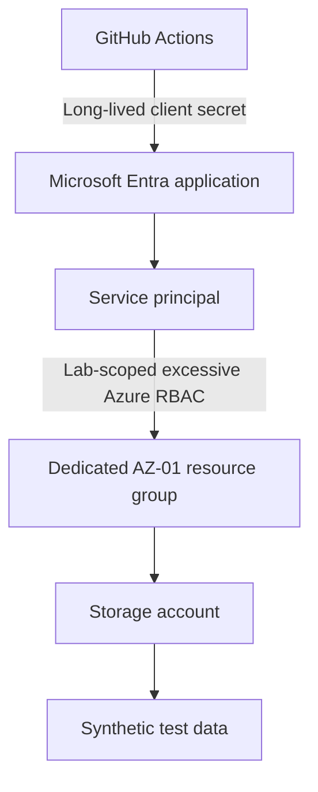
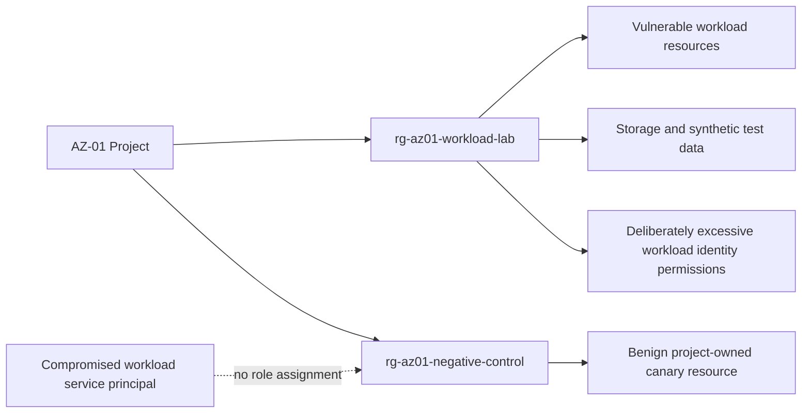
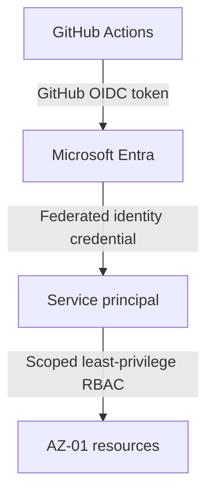

# Phase 1 Architecture

## Security Objective

This lab will show how a long-lived workload credential and deliberately excessive Azure RBAC can be abused, then replace that design with GitHub OIDC and least-privilege authorization. Every future experiment is constrained to project-owned AZ-01 resource groups and synthetic data.

No infrastructure described here exists yet.

## Planned Vulnerable State

The intentional weakness is a temporary client secret used by GitHub Actions and an RBAC role that is excessive for the workload, but only within the dedicated lab resource group. It is not subscription-wide Owner, subscription-wide Contributor, Global Administrator, Privileged Role Administrator, or unrestricted tenant access.

## Project-Owned Resource-Group Boundaries

`rg-az01-workload-lab` is the future authorization boundary for the compromised workload identity. `rg-az01-negative-control` is also AZ-01-owned project infrastructure, but contains only a benign canary resource and has no workload service-principal role assignment. Exact final Azure names are implementation details; this two-boundary design is mandatory.

## Planned Remediated State

The federated credential will be restricted to the intended GitHub repository and branch or environment. The final role assignments will permit only the workload actions required within the narrowest practical scope.

## Identity Flow

In the vulnerable state, GitHub Actions presents a long-lived client secret to Microsoft Entra and receives a token for the service principal. In the remediated state, GitHub Actions exchanges a short-lived OIDC token for a Microsoft Entra token under an exact federated subject claim. The secret is removed.

Authentication establishes the identity of the service principal. Authorization is separately evaluated by Azure RBAC and any applicable data-plane authorization.

## Azure Control-Plane Flow

Azure Resource Manager evaluates the service principal's Azure RBAC assignment before allowing management-plane operations on resources in `rg-az01-workload-lab`. Future tests may demonstrate an intentionally excessive, but resource-group-scoped, action and then verify that the narrowed role denies it after remediation. The same identity has no role assignment on `rg-az01-negative-control`; the benign canary is used only for a harmless authorization-negative test.

## Azure Data-Plane Flow

Data-plane access is distinct from Azure Resource Manager control-plane access. A future synthetic-data test will use only explicitly granted data-plane permissions and will record whether the final least-privilege design still requires that access. No production or sensitive data is in scope.

## Trust and Security Boundaries

- GitHub to Microsoft Entra: GitHub workflow identity and OIDC or secret-based authentication cross into Microsoft Entra.
- Microsoft Entra to Azure Resource Manager: an issued token crosses from identity authentication to Azure authorization.
- Azure Resource Manager to target resources: management-plane permissions are evaluated separately for the workload-lab and negative-control resource groups.
- Management plane to data plane: resource administration and data access require separate authorization decisions.
- Local administrator/test operator to Azure: local Azure CLI use is limited to controlled setup and validation.

Both AZ-01 resource groups are project infrastructure, but only `rg-az01-workload-lab` is inside the compromised identity's authorization boundary. `rg-az01-negative-control` proves that containment with a known benign canary. Future attack tests must not enumerate, read, modify, or attack arbitrary resources elsewhere in the subscription.

## Assumptions

- Future infrastructure is deployed only after design review and is managed by Terraform.
- The vulnerable credential is intentionally temporary and is removed during remediation.
- All sample data is synthetic and non-sensitive.
- Evidence is redacted before publication.

## Future Terraform Ownership

Terraform will remain the source of truth for all future configuration. The planned `hashicorp/azuread` provider owns Microsoft Entra identity objects: the Entra application, service principal, temporary application/client password for the vulnerable phase, and federated identity credential. The planned `hashicorp/azurerm` provider owns Azure resource-plane objects: resource groups, storage resources, Azure RBAC role assignments, and other Azure resources. Azure Portal use is limited to visual verification and evidence; it is not a configuration path. This Phase 1 documentation does not add the `azuread` provider to Terraform configuration.
