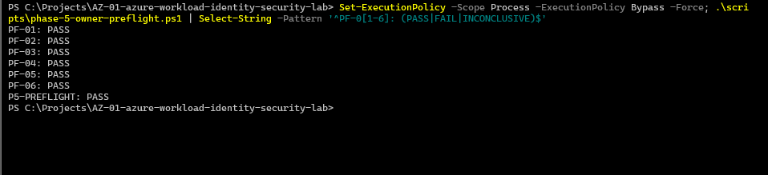
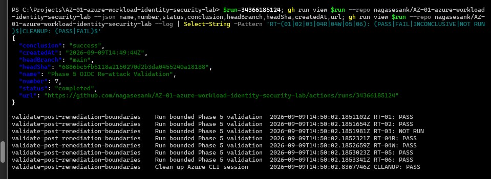
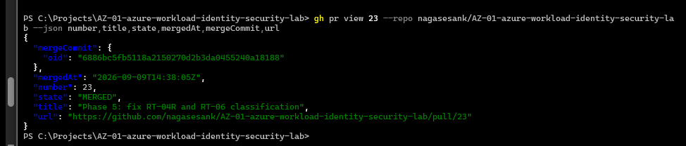

# Phase 5 Post-Remediation Runtime Validation

Status: Runtime validation and evidence review complete; later validation deployment teardown complete.

Execution date: 2026-09-09

## Objective

Record the owner-verified post-remediation runtime results for the tested workload session, known project-owned targets, and synthetic data. This record uses the owner's supplied verified outcomes; no runtime operations were performed to prepare this documentation.

## Phase/baseline relationship

Phase 3 remains the immutable vulnerable/pre-remediation baseline. Phase 4 and Phase 5 use the later secretless deployment, in a different deployment window. These results do not establish in-place revocation or replay failure of the historical Phase 3 credential. The historical `scripts/attack-tests.ps1` relies on retired vulnerable-secret outputs and must not be reused against the later Phase 4/5 deployment, which has now been destroyed.

## Reviewed workflow provenance

[PR #23](https://github.com/nagasesank/AZ-01-azure-workload-identity-security-lab/pull/23) merged as commit `6886bc5fb5118a2150270d2b3da0455240a18188`. It changed only `.github/workflows/phase-5-oidc-validation.yml`, fixing RT-04R result sequencing and RT-06 explicit authorization-denial classification. This is the reviewed Phase 5 workflow baseline.

The workflow records RT-04R PASS after the first successful positive control and recognizes the exact Azure CLI permission-denial message alongside explicit authorization codes. Generic HTTP 403 and ambiguous failures are not sufficient for PASS; unexpected command success remains FAIL.

## Owner preflight

The owner reported successful completion of all six preflight checks.

| Check | Observed result |
| --- | --- |
| PF-01 | PASS |
| PF-02 | PASS |
| PF-03 | PASS |
| PF-04 | PASS |
| PF-05 | PASS |
| PF-06 | PASS |

PF-03 verified credential absence through configuration inspection of the workload application/service principal. This was not an old-secret replay test and does not prove the retired Phase 3 credential was replay-tested or revoked in place. Preflight readiness does not itself establish workload authorization.

## Non-mutating runtime validation

[GitHub Actions run 34364948091](https://github.com/nagasesank/AZ-01-azure-workload-identity-security-lab/actions/runs/34364948091) completed the non-mutating validation. Neither mutation probe ran.

| Test | Observed result |
| --- | --- |
| RT-01 | PASS |
| RT-02 | PASS |
| RT-03 | NOT RUN |
| RT-04R | PASS |
| RT-04W | NOT RUN |
| RT-05 | PASS |
| RT-06 | PASS |
| Cleanup | PASS |

## RT-03 management-plane mutation-denial validation

[GitHub Actions run 34365628446](https://github.com/nagasesank/AZ-01-azure-workload-identity-security-lab/actions/runs/34365628446) used `enable_rt03=true` and `enable_rt04w=false`.

| Test | Observed result |
| --- | --- |
| RT-01 | PASS |
| RT-02 | PASS |
| RT-03 | PASS |
| RT-04R | PASS |
| RT-04W | NOT RUN |
| RT-05 | PASS |
| RT-06 | PASS |
| Cleanup | PASS |

The reviewed benign workload resource-group tag mutation attempt received an explicit authorization denial. This establishes denial only for that tested mutation action against the known workload resource group.

## RT-04W storage write-denial validation

[GitHub Actions run 34366185124](https://github.com/nagasesank/AZ-01-azure-workload-identity-security-lab/actions/runs/34366185124) used `enable_rt03=false` and `enable_rt04w=true`.

| Test | Observed result |
| --- | --- |
| RT-01 | PASS |
| RT-02 | PASS |
| RT-03 | NOT RUN |
| RT-04R | PASS |
| RT-04W | PASS |
| RT-05 | PASS |
| RT-06 | PASS |
| Cleanup | PASS |

The dedicated synthetic blob creation/write attempt received an explicit authorization denial. The baseline synthetic blob was not overwritten. This result does not establish universal storage-write denial.

## Consolidated results

PF-01 through PF-06 passed. The following results consolidate the three separate dispatches; they do not represent one run with both mutation probes enabled.

| Test | Observed result |
| --- | --- |
| RT-01 | PASS |
| RT-02 | PASS |
| RT-03 | PASS |
| RT-04R | PASS |
| RT-04W | PASS |
| RT-05 | PASS |
| RT-06 | PASS |
| Cleanup | PASS |

Cleanup passed in every dispatch.

## Security interpretation

| Test | Bounded interpretation |
| --- | --- |
| RT-01 | GitHub OIDC authentication succeeded and the intended Azure subscription/tenant context was validated for the tested workload session; identifiers are omitted. |
| RT-02 | The tested resource-list operation against the known workload resource group received explicit authorization denial. |
| RT-03 | The reviewed benign tag mutation against the known workload resource group received explicit authorization denial. |
| RT-04R | Microsoft Entra-authenticated metadata access succeeded for the exact known synthetic blob. |
| RT-04W | Creation of the dedicated synthetic write-probe blob received explicit authorization denial. |
| RT-05 | Access to the exact known project-owned negative-control canary received explicit authorization denial. |
| RT-06 | Account-level container listing against the known workload storage account received explicit authorization denial. |
| Cleanup | Workload CLI session/profile cleanup passed; this is separate from infrastructure teardown. |

## Limitations

- Credential absence was configuration inspection, not retired-secret replay testing; no old-secret revocation or replay-failure claim is made.
- Phase 3 and Phase 5 represent different deployment windows.
- RT-04R validates metadata access to one known synthetic blob, not arbitrary storage reads/downloads.
- RT-02 proves only the tested workload-RG enumeration denial.
- RT-03 proves only the tested benign tag mutation denial.
- RT-04W proves only the dedicated synthetic blob-write denial, not all possible storage write actions.
- RT-05 proves only access denial against the known negative-control canary.
- RT-06 proves only account-level container-list denial against the known workload storage account, not denial against every other storage API, container, blob, or account.
- Raw GitHub Actions logs are not preserved as public evidence because authentication output may include sensitive identifiers/OIDC context.
- No deletion, key retrieval, SAS generation, role changes, production-data access, or arbitrary subscription enumeration was performed during this validation.
- These bounded observations do not establish universal least privilege or universal authorization denial.
- Screenshot publication and evidence review are complete; no screenshot or runtime evidence was fabricated for this documentation.

## Evidence screenshots

The five sanitized Phase 5 PNG files are preserved in the repository and were reviewed before teardown.

## Teardown status

The later Phase 4/5 validation deployment was destroyed after Phase 5 evidence review. Owner-operated Terraform destroy completed successfully, and bounded post-destroy checks verified empty Terraform state and absence of the exact known workload resource group, negative-control resource group, workload Entra application, and workload service principal. The Phase 5 GitHub repository secrets were also removed and verified absent.

See the [Phase 7 teardown validation](phase-7-teardown-validation.md) for the cleanup evidence and limitations.

Return to the [evidence index](README.md).
