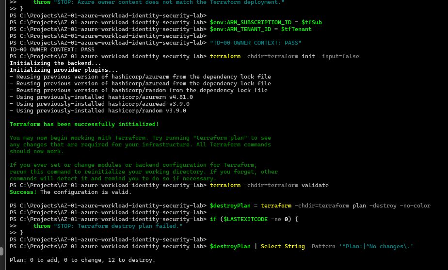
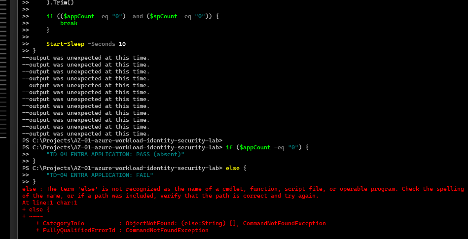
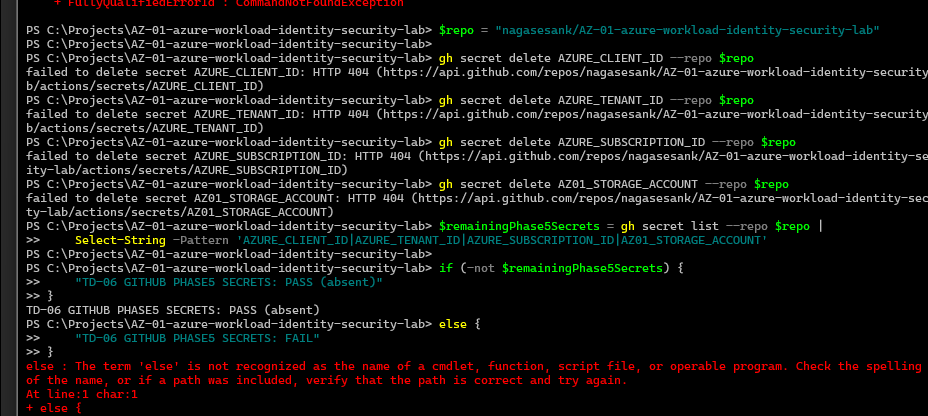

# Phase 7 Teardown Validation

Status: Owner-operated teardown and bounded cleanup verification complete.

Execution date: 2026-09-09

## Objective

Record the verified teardown of the later Phase 4/5 secretless validation deployment after Phase 5 evidence capture. This record is limited to the exact project-owned targets and repository settings that were explicitly checked.

## Owner-verified results

| Check | Observed result |
| --- | --- |
| TD-00 owner context | PASS |
| TD-01 Terraform state | PASS (empty) |
| TD-02 workload resource group | PASS (absent) |
| TD-03 negative-control resource group | PASS (absent) |
| TD-04 workload Microsoft Entra application | PASS (absent) |
| TD-05 workload service principal | PASS (absent) |
| TD-06 Phase 5 GitHub repository secrets | PASS (absent) |

Terraform destroy completed successfully before the post-destroy verification.

The four Phase 5 repository secrets used for bounded runtime validation were removed after teardown: `AZURE_CLIENT_ID`, `AZURE_TENANT_ID`, `AZURE_SUBSCRIPTION_ID`, and `AZ01_STORAGE_ACCOUNT`. Values are not preserved in public evidence.

## Evidence screenshots

## Security and evidence hygiene

Public evidence excludes Azure subscription, tenant, client/application, object/principal identifiers; OIDC subjects; tokens; credentials; Terraform state and plans; CLI caches; and raw sensitive logs. The checks use exact known project-owned targets rather than arbitrary subscription enumeration.

## Limitations

- Terraform state was verified empty after destroy, but state content is not published as evidence.
- Resource absence was verified only for the exact known workload and negative-control resource groups, workload Entra application, and workload service principal.
- This does not establish universal subscription-wide cleanup or deletion of unrelated resources.
- This teardown is separate from historical Phase 3 credential replay questions and does not establish old-secret revocation or replay failure.
- No production, customer, personal, or arbitrary subscription resources were part of the verification.

Phase 6 CI/CD security controls remain future work. Phase 7 teardown/cleanup evidence is complete; final retrospective/project closeout remains pending.

Return to the [evidence index](README.md).
